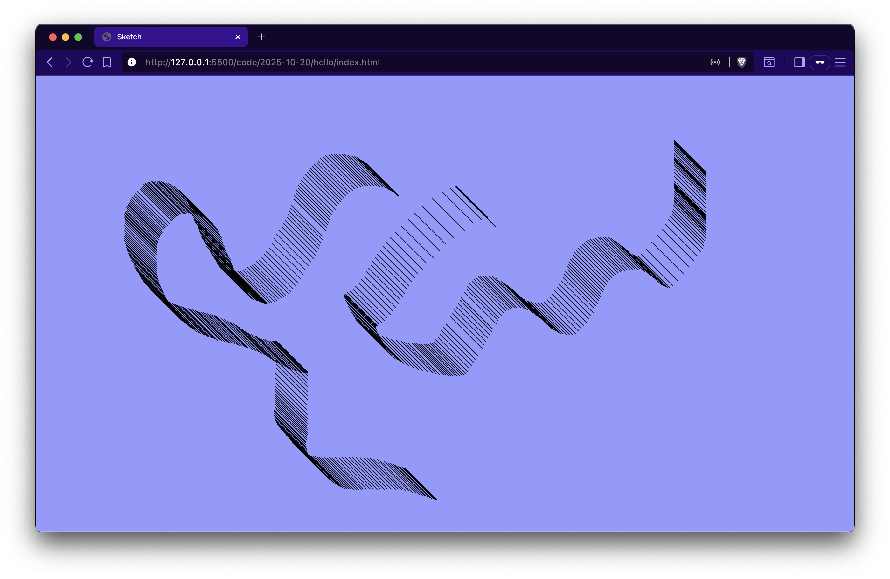
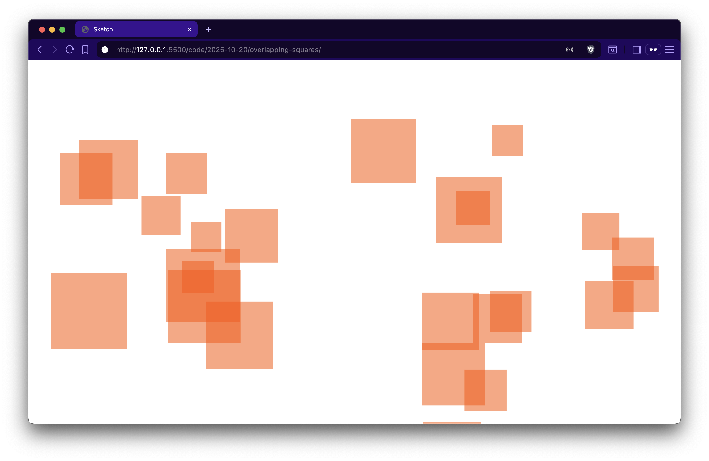
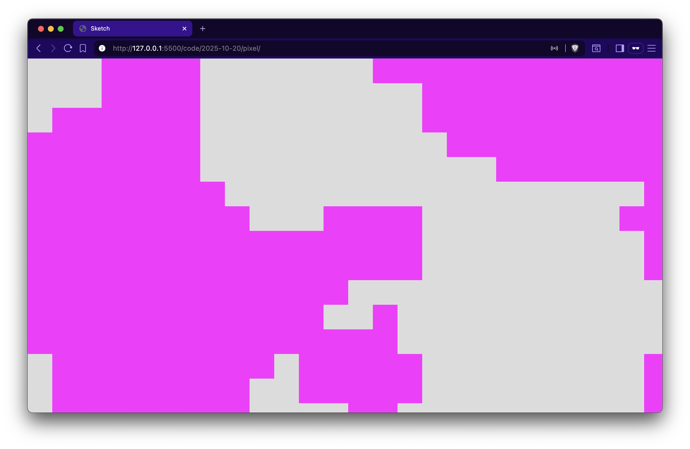

# 2025-10-20

First day of creative coding explorations with p5.js.

## Projects

### [hello](hello/)
Interactive drawing sketch that allows users to draw lines by pressing the mouse.

### [overlapping-squares](overlapping-squares/)
Generative art piece featuring semi-transparent overlapping rectangles in HSB color mode.

### [pixel](pixel/)
Animated Perlin noise visualization with spreading centers and organic pixel patterns. Started from the idea of the Game Of Life.

