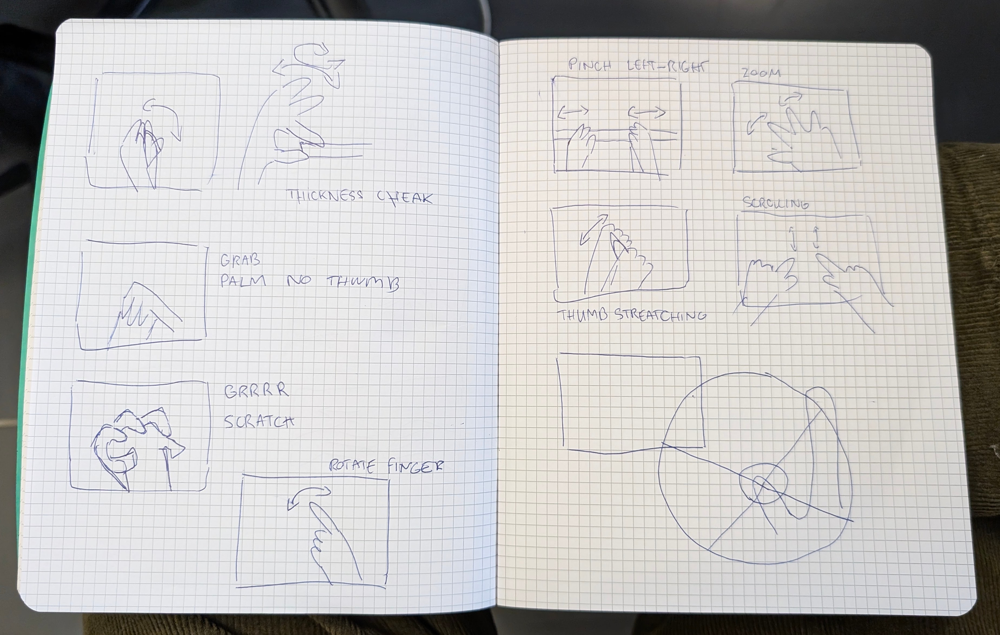

# Gestures

I observed other students' gestures in the school.

## Interesting foundings:
- Using thumb as a compass
- Differents ways of using the trackpad (scrolling with 2 fingers different hands)
- Using the thumb as a joystick to stretch