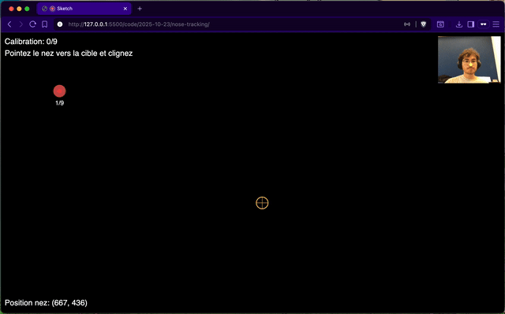

# 2025-10-23

Fourth day. Added face recognition.

## Projects

### [nose-tracking](./nose-tracking/)
Tried to code entirerly with Copilot, not fun but faster. I don't even know how it's done. I don't like this feeling, I feel like I have unlearned things.

### [magic](./magic/)
This was a test to see if i could map a visual on the face.
Haven't managed to tell copilot what I wanted