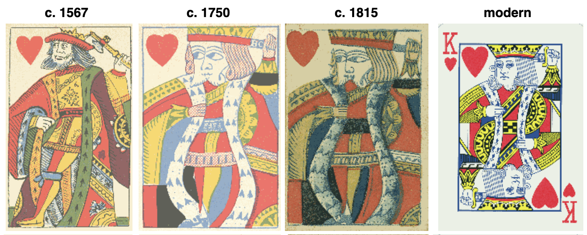
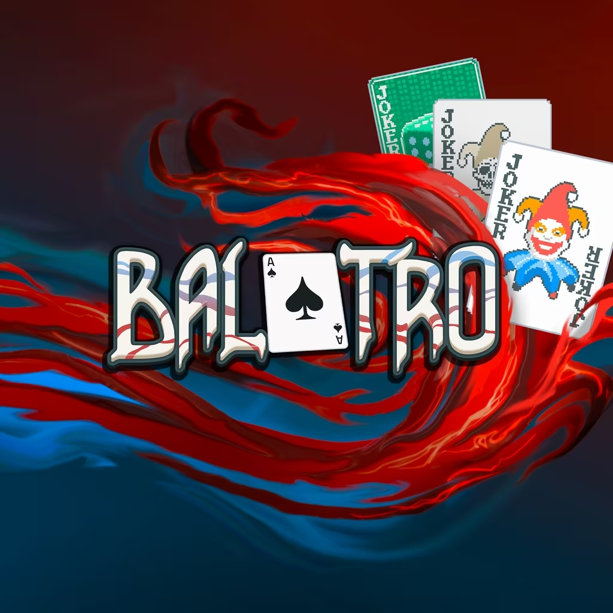

# Antony NEYRET

## Research
I explored the history of playing cards globally then narrowed down to anecdotes and visual details in the French deck that could be used to tell a story.

- Printing errors can become cultural myths  like the King of Hearts’ missing mustache and misplaced sword, evolved into lasting cultural legends.

- Playing cards are more than cards: they have political, cultural and design history [Spreadsheet with facts](https://docs.google.com/spreadsheets/d/1icYrt-z572ls68dVIPBTLnkSGJya6dV888MtH4_C5rM/edit?usp=sharing)

- Audiences engage best when history is told as playful stories rather than as dry facts.

- Blurred line between myth and reality. Could be good for storytelling.

- Cards where the mirror of society (The Ace of Spades was used as a tax card in England) certains suits kept hints (Ace of spade is still a huge symbolic card e.g Balatro): 

## Concept: The Lost Moustache

A lost moustache goes on a playful journey through the deck of cards. It tries itself on different suits and across time periods before finally finding its way back home to the (French version) King of Hearts. The interaction tells stories with (possibly) the smallest amount of text and humor to teach in “historical” facts and cool anecdotes. The goal is that visitors learn without realizing it and remember the quirky stories once they leave the museum.

## Keyword
Lost Details

## User Journey

## Novel Combinations
- Playful
- Storytelling
- Facts