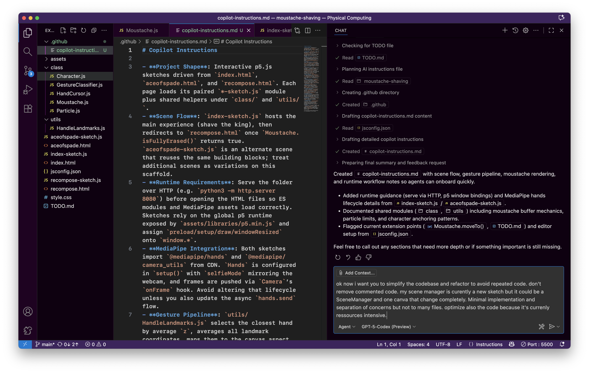

# 2025-11-10 COPILOT AGENT REFACTORING

First I asked copilot to create a `copilot-instruction.md` with all the knowledge of the current workspace/folder.

**Model**: GPT-5-Codex in Agent Mode 

I don't know if the code is better or usable but for now it's easier to prompt to add new things with the `copilot-instruction.md` file.

### FULL CONVERSATION

antonynyt: Analyze this codebase to generate or update `.github/copilot-instructions.md` for guiding AI coding agents.

Focus on discovering the essential knowledge that would help an AI agents be immediately productive in this codebase. Consider aspects like:
- The "big picture" architecture that requires reading multiple files to understand - major components, service boundaries, data flows, and the "why" behind structural decisions
- Critical developer workflows (builds, tests, debugging) especially commands that aren't obvious from file inspection alone
- Project-specific conventions and patterns that differ from common practices
- Integration points, external dependencies, and cross-component communication patterns

Guidelines (read more at https://aka.ms/vscode-instructions-docs):
- If `.github/copilot-instructions.md` exists, merge intelligently - preserve valuable content while updating outdated sections
- Write concise, actionable instructions (~20-50 lines) using markdown structure
- Include specific examples from the codebase when describing patterns
- Avoid generic advice ("write tests", "handle errors") - focus on THIS project's specific approaches
- Document only discoverable patterns, not aspirational practices
- Reference key files/directories that exemplify important patterns

---
Created copilot-instructions.md with scene flow, gesture pipeline, moustache rendering, and runtime workflow notes so agents can onboard quickly.

- Added runtime guidance (serve via HTTP, p5 window bindings) and MediaPipe hands lifecycle details from index-sketch.js/aceofspade-sketch.js.
- Documented shared modules (class, utils) including moustache buffer mechanics, particle limits, and character anchoring patterns.
- Flagged current extension points (`Moustache.moveTo()`, TODO.md) and editor setup from jsconfig.json.

Feel free to call out any sections that need more depth or if something important is still missing.

Made changes.

---

**antonynyt**: ok now i want you to simplify the codebase and refactor to avoid repeated code. don't remove commented code. my scene manager is curently a new sketch but it could be a SceneManager and one canva that change completely. Minimal implementation and separation of concerns but not to many files. optimize also the code because it's currenly ressources intensive.

---

Implemented a single shared p5 sketch with reusable scene management to eliminate duplicated setup and asset loading.

- Added sketch.js to preload assets, initialise MediaPipe Hands once, and drive all pages via `startSketch(sceneName)`.
- Introduced SceneManager.js plus index.js with `KingScene`, `AceScene`, and `RecomposeScene`, so scenes swap on a single canvas while sharing hand tracking and assets.
- Simplified the page entry scripts to just bootstrap the desired scene, and tuned `HandCursor`/`HandleLandmarks` to match the new shared pipeline and avoid looping audio playback.
- Updated copilot-instructions.md to document the new architecture and workflow.

Recommend serving the folder (`python3 -m http.server 8080`) and sanity-checking each scene switch. Let me know if you want further tweaks or if any behaviour changed unexpectedly.

---

antonynyt: can you split scenes into their files and import the scenes instead of creating empty files with just startSketch("ace"); ? I also want to change the bubble text and the instruction per scenes

**Scene Refactor & Copy Update**
- Split the monolithic index.js into KingScene.js, AceScene.js, RecomposeScene.js, plus BaseScene.js and shared.js for reuse; index.js now simply re-exports them and builds the map.
- Extended `startSketch()` to take a `{ createScenes }` override so each entry point can register only the scenes it needs; updated index-sketch.js, aceofspade-sketch.js, and recompose-sketch.js to import and wire their scenes explicitly.
- Refreshed scene instructions and speech bubbles in index.html, aceofspade.html, and recompose.html, adding an info banner to the recompose view.
- Synced copilot-instructions.md with the new structure and workflow.

Made changes.

---

antonynyt: remove not used methods, consts params, do not remove commented code. remove unused html and js files.

---
Completed another cleanup pass and wired scene-specific UI copy for the single-page flow.

- Trimmed unused physics fields and the dead `moveTo` stub from Moustache.js.
- Registered the Ace scene in index-sketch.js so `KingScene` can hand off correctly, and pointed the switch to `"ace"`.
- Added `shared.setOverlayText` in sketch.js plus scene-level calls in KingScene.js, AceScene.js, and RecomposeScene.js to update the info banner and speech bubble as scenes change.
- Updated copilot-instructions.md to describe the consolidated entry point and overlay helper.
- Removed the redundant `aceofspade`/`recompose` HTML and bootstrap scripts; everything now runs through index.html.

You’re set to keep iterating from here. Next step: serve the folder (`python3 -m http.server 8080`) and confirm the overlays swap correctly when scenes change.

Made changes.

---

antonynyt: is sketch.js used ?

GitHub Copilot: Yes. index-sketch.js imports `{ startSketch }` from sketch.js and calls it on load, so the entire app still runs through sketch.js for asset loading, Mediapipe setup, and scene management. No other entry points remain after the cleanup, so sketch.js is essential.

---

antonynyt: can it be just one sketch ?

GitHub Copilot: Yep—everything already runs from a single p5 sketch. index-sketch.js simply calls `startSketch()` and hands scene creation back to sketch.js, which owns asset loading, Mediapipe setup, and the shared canvas. Additional scenes simply register with the `SceneManager`; no extra canvases or duplicate p5 lifecycles are created.

---

antonynyt: but then the code inside sketch is useless non ?

GitHub Copilot: sketch.js is still the heart of the runtime—nothing in it is redundant. It’s where we:

- preload all assets once (`loadAssets()` inside `preload()`),
- initialise Mediapipe Hands and the `Camera`,
- build shared state (`GestureClassifier`, `HandCursor`, `SceneManager`, overlay updater),
- register scenes via `createScenes` (or the override you pass from index-sketch.js),
- and wire the p5 lifecycle (`window.preload/setup/draw/windowResized`).

index-sketch.js just chooses the initial scene and, if desired, prunes the scene list; the heavy lifting still happens in sketch.js. If we removed it, you’d lose asset loading, hand tracking, and scene orchestration.

---

antonynyt: i feel like it could be just one sketch not index-sketch and sketch.js.

Summarized conversation history

- index-sketch.js — sole p5 entry point
- index.html — loads the sketch
- class/ — helpers like SceneManager, GestureClassifier, HandCursor, Moustache, Particle
- scenes/ — King, Ace, Recompose scenes plus shared utilities
- HandleLandmarks.js — landmark processing wrapper
- assets/ — images, fonts, Mediapipe libs, audio
- style.css — overlay styling
- jsconfig.json — module resolution config
- TODO.md — project notes

Made changes.

---

antonynyt: multiple object could be shaved in the futur, for know only the moustache but later other character design would be also shaved

Introduced a reusable shaveable-sprite pipeline so scenes can register more than one target and keep state across resizes.  
- ShaveableSprite.js: new generic sprite that handles buffer erasure, particle emission, rotation noise, and position updates.  
- Moustache.js: now extends the shared sprite while preserving the existing API.  
- Character.js: supports named anchors via `getAnchorPosition`, keeping `getMoustachePosition()` for current callers.  
- KingScene.js and AceScene.js: swapped hard-coded moustache handling for definition-driven shave-target collections, positioning via anchors, and shared draw/erase helpers; Ace scene’s teleport now works with any registered sprite.

I didn’t run the sketch—please serve index.html (e.g. `python3 -m http.server 8080`) to make sure the new setup behaves as expected.

Next steps you might consider:
1. Add additional shave target definitions (e.g. beards, eyebrows) to the scenes to take advantage of the new scaffold.
2. Extend `ShaveableSprite` configs for per-target erase radii or completion thresholds if future assets need different tuning.

---

antonynyt: make the razor sound louder when approching a shaving area

---

- Added proximity-driven volume logic to HandCursor.js, including configurable base/max levels and live updates via `updateShaveProximity`.
- Extended ShaveableSprite.js with `distanceToPoint()` so scenes can measure cursor distance to any shave target.
- Updated KingScene.js and AceScene.js to track cursor proximity for each target, feed it to the hand cursor, and store per-target proximity ranges.

Serve index.html (e.g. `python3 -m http.server 8080`) and try hovering/closing the hand near a moustache to confirm the razor sound ramps up as you approach.

Made changes.

---

antonynyt: The recompose scene is the 2nd scene but it's not interactive it should play the video assets/videos/recomposing.webm with alpha

--- 

Copilot: Wired the Recompose scene into the flow and replaced its moustache animation with the alpha video interlude.
- KingScene.js: now hands off to `recompose` after the royal shave so the video plays second.
- index-sketch.js: assets bundle exposes `videos.recompose` so scenes can lazily create the media element.
- RecomposeScene.js: swapped the moustache choreography for a non-interactive video player that shows recomposing.webm, fades it in with transparency, and autocascades to `ace` when playback finishes.
